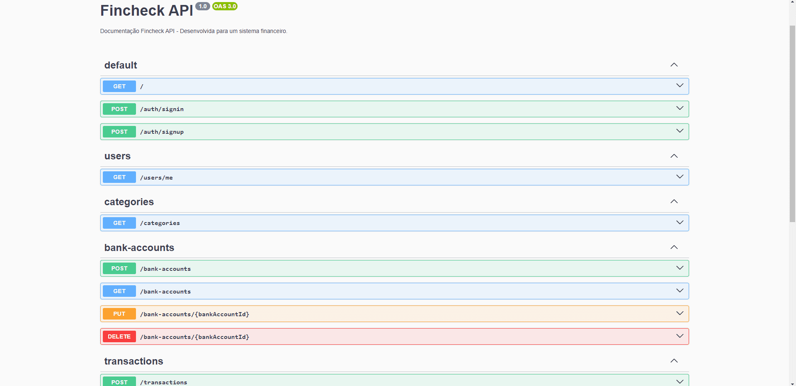
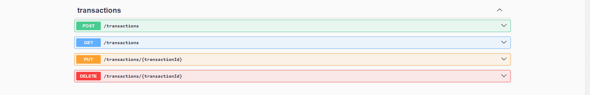

# Fincheck - api

Essa API foi desenvolvida durante o curso JStack, além de ter proposito de aprimorar meu conhecimento em NestJS, Essa api foi feita para consumo em um projeto de gestão de finanças, o fincheck fe , esse projeto busca fornecer informações para melhor gestão financeira dos usuarios.

## 🛠️ Tecnologias

📁 **Back-end**

- [Nest.js](https://docs.nestjs.com/): Optei por usar o Nest.js como framework para o back-end devido à sua arquitetura de modulos e baseada em conceitos sólidos. A estrutura orientada a módulos e a integração com TypeScript possibilitam uma estrutura sólida para o desenvolvimento, facilitando a manutenção e escalabilidade do código.

- [MongoDB](https://www.mongodb.com/pt-br): Escolhi MongoDB para o banco de dados por conta do seu modelo de dados flexivel, e por conta de sua facilidade com integração em diferentes linguagens de progamação.

- [Mongoose](https://mongoosejs.com/): O mongoose foi escolhido para fazer a conexão com o banco de dados e sua facilidade em fazer isso.

- [Prisma](https://www.prisma.io/): Utilizei o prisma como ORM, que facilita muito a interação com o banco de dados fazendo tarefas como criar e atualizar coisas no banco serem muito mais simples de serem realizadas.

🔋 **Controle de versão e deploy**

- [Git](https://git-scm.com) Utilizei Git para controle de versionamento, o que facilita o trabalho colaborativo e o acompanhamento das alterações no código.

- [Vercel](https://vercel.com/) A escolha da Vercel para deploy foi feita devido à sua integração fácil com repositórios Git e sua eficiência no deployment de aplicações.

## Documentação

A documentação da API é gerada automaticamente pelo Swagger, proporcionando facilidade na compreensão e utilização da API. Isso possibilita uma integração suave para os desenvolvedores.

Fique à vontade para explorar a documentação e tirar proveito dos recursos disponibilizados por esta API para impulsionar seus projetos financeiros. Me dediquei ao maximo para conseguir oferecer uma boa experiência para os usuarios dessa api, e tambem para auxiliar os devs que buscam ajuda na documentação.

Certifique-se de explorar a documentação detalhada no Swagger para uma compreensão completa dos recursos da API, facilitando assim a implementação em seus projetos financeiros.

Espero que isso atenda às suas necessidades! Se precisar de mais ajustes ou informações, estou à disposição.

## Doc Swagger

⚙️ **Configuranções e Instalações**

Clone do Projeto

    $ git clone https://github.com/Faelkk/fincheck-api

Instalando as dependências

    $ npm install

Iniciando o projeto

    $ npm run dev

 

**Como me ajudar nesse projeto?**

- Você ira me ajudar muito me seguindo aqui no GitHub
- Dando uma estrela no projeto
- Conectando-se comigo no LinkedIn para fazer parte da minha rede.

 

**Feito por**
[Rafael Achtenberg](linkedin.com/in/rafael-achtenberg-7a4b12284/)
